<!-- ============================================================ -->
<!-- CARÁTULA -->
<!-- ============================================================ -->

<div align="center">

# Universidad Católica del Uruguay

### Desarrollo de Software Seguro

# Consigna Práctica 1: Creación de Ambiente de Trabajo


**Belén Kanas** 

**Desarrollo de Software Seguro** 

**Profesores:** 

Wiler Alvez

Nicolás Piquerez

Alejandro Piccardo

Leonardo Conde

**15 de agosto de 2026**

----------
</div>


<div style="page-break-after: always;"></div>

<!-- ============================================================ -->
<!-- INTRODUCCIÓN Y OBJETIVO -->
<!-- ============================================================ -->

## Introducción

Este documento registra el armado completo de un **ambiente de pruebas de aplicaciones web**, un entorno controlado y aislado donde se pueden analizar aplicaciones en busca de vulnerabilidades de seguridad sin poner en riesgo sistemas reales. Para lograrlo, se combinan varias herramientas:

- Una **máquina virtual (VM)**, que es una "computadora dentro de la computadora": un entorno aislado donde se puede instalar un sistema operativo distinto (en este caso, Kali Linux) sin afectar el sistema operativo principal.
- Un **proxy de interceptación**, que es una herramienta que se ubica "en el medio" entre el navegador y las aplicaciones web, permitiendo ver y modificar el tráfico (las solicitudes y respuestas) que viaja entre ambos. Es la herramienta central para analizar cómo funciona una aplicación web por dentro.
- **Docker**, una tecnología que permite ejecutar aplicaciones dentro de "contenedores": paquetes autocontenidos con todo lo necesario para correr (código, dependencias, configuración), sin tener que instalar cada programa manualmente en el sistema.
- Dos **aplicaciones vulnerables de práctica**: OWASP Juice Shop y OWASP crAPI, diseñadas intencionalmente con fallas de seguridad para que sirvan como laboratorio de aprendizaje.

## Objetivo del práctico

El objetivo de este trabajo es documentar, de manera clara y reproducible, la configuración completa del ambiente que se utilizará en actividades posteriores de la materia. Puntualmente, se busca dejar registro de:

1. La instalación de una máquina virtual con Kali Linux.
2. La instalación de un proxy de interceptación (Burp Suite).
3. La instalación de Visual Studio Code dentro de la máquina virtual.
4. La instalación de Docker dentro de la máquina virtual.
5. La ejecución de OWASP Juice Shop en un contenedor Docker.
6. La ejecución de OWASP crAPI en un ambiente Dockerizado.
7. La comprobación de que el proxy de interceptación logra visualizar el tráfico generado por las aplicaciones anteriores.

<div style="page-break-after: always;"></div>

<!-- ============================================================ -->
<!-- PASO 1 -->
<!-- ============================================================ -->

## Paso 1 – Instalación de la máquina virtual Kali Linux

Kali Linux es una distribución de Linux orientada específicamente a pruebas de seguridad, ya que viene con numerosas herramientas preinstaladas para ese fin. Para poder usarla sin modificar la computadora física, se instala dentro de un **hipervisor**: un programa que permite crear y administrar máquinas virtuales.

### 1.1. Instalación de Oracle VirtualBox

Se instaló Oracle VirtualBox como hipervisor, descargándolo desde su sitio oficial ([virtualbox.org](https://www.virtualbox.org/wiki/Downloads)).

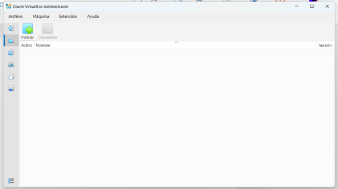


### 1.2. Descarga e instalación de la imagen de Kali Linux

Se descargó la imagen oficial de Kali Linux ya preparada para máquina virtual, desde la página oficial del proyecto: [kali.org/get-kali/#kali-virtual-machines](https://www.kali.org/get-kali/#kali-virtual-machines).

Descarga de Kali Linux en la página oficial:
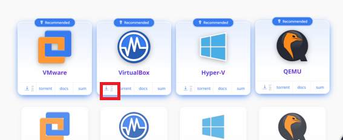

Ejecución del instalador (ejecutable con extensión `.vbox`):
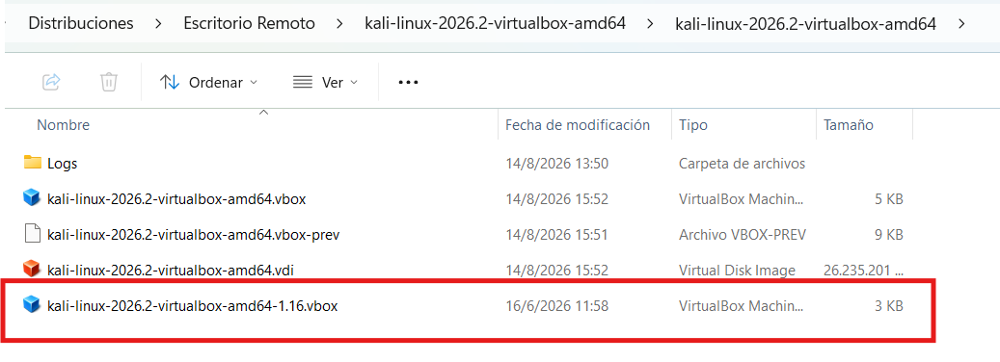


### 1.3. Primer acceso a la máquina virtual

Una vez importada la imagen, se inició la máquina virtual con las credenciales por defecto que trae Kali Linux:

- **Usuario:** `kali`
- **Contraseña:** `kali`

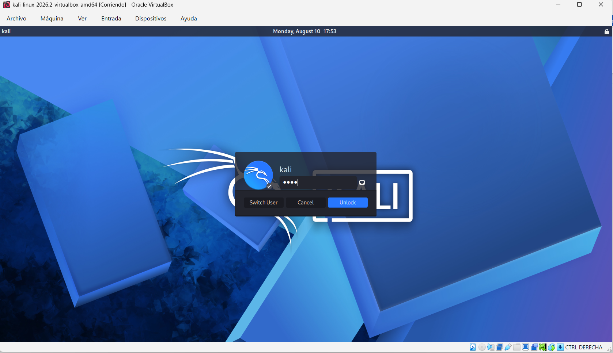

<div style="page-break-after: always;"></div>

<!-- ============================================================ -->
<!-- PASO 2 -->
<!-- ============================================================ -->

## Paso 2 – Instalación de un proxy de interceptación (Burp Suite)

Existen dos herramientas principales para este fin: **Burp Suite** y **OWASP ZAP**. 

Aunque ambas cumplen la misma función (interceptar y analizar tráfico web), se optó por **Burp Suite (edición Community, gratuita)** por dos motivos:

- Es el estándar de facto en la industria: la mayoría del material de estudio, cursos, certificaciones (como OSCP) y plataformas de práctica (HackTheBox, TryHackMe) asumen el uso de Burp.
- Su interfaz resulta más intuitiva para quien recién comienza a interceptar tráfico manualmente.


### 2.1. Instalación

Kali Linux incluye Burp Suite Community en sus repositorios oficiales, por lo que la instalación se resume a dos comandos ejecutados desde la terminal:

```bash
sudo apt update
```
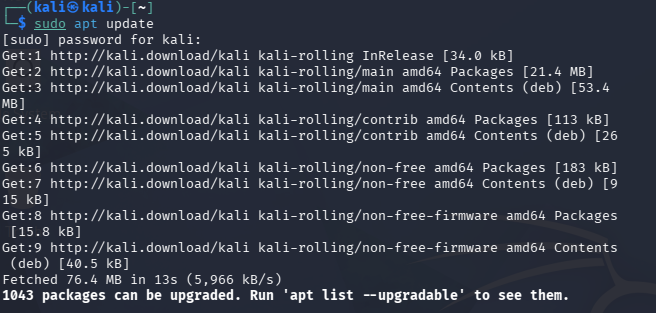


```bash
sudo apt install burpsuite -y
```
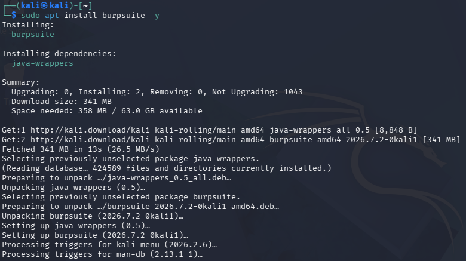


> **Nota:** inicialmente se intentó instalar Burp descargando el instalador `.sh` directamente desde el sitio de PortSwigger, pero la ejecución quedaba trancada sin completarse. Se optó entonces por la instalación desde los repositorios oficiales de Kali, que resultó más simple y confiable.

### 2.2. Verificación de la instalación

Para confirmar que el paquete quedó correctamente instalado:

```bash
dpkg -l | grep -i burp
which burpsuite
```

> **Tip:** Si el primer comando devuelve una línea que comienza con `ii` (instalado correctamente) y el segundo devuelve la ruta `/usr/bin/burpsuite`, la instalación fue exitosa.

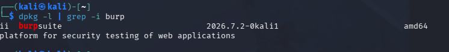
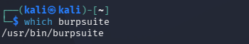

Así se ve la interfaz oficial de la herramienta instalada:
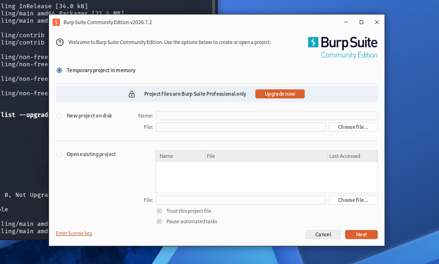

<div style="page-break-after: always;"></div>

<!-- ============================================================ -->
<!-- PASO 3 -->
<!-- ============================================================ -->

## Paso 3 – Instalación de Visual Studio Code

Se instaló Visual Studio Code (VS Code), un editor de código, siguiendo el instructivo oficial de Microsoft (https://code.visualstudio.com/docs/setup/linux), en la sección correspondiente a distribuciones basadas en Debian (ya que Kali Linux se basa en Debian).

### 3.1. Instalación

Se descargó el paquete `.deb` oficial desde el sitio de VS Code y se instaló con:

```bash
sudo apt install ./code_<versión>_amd64.deb
```
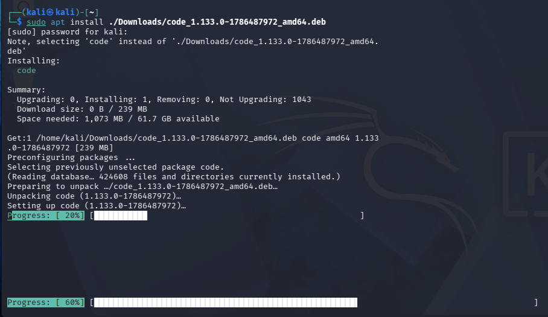


> **Nota:** durante la instalación se debe verificar que el comando se ejecute desde la carpeta correcta donde se descargó el archivo (por defecto, `~/Downloads`), respetando mayúsculas y minúsculas, ya que en Linux los nombres de carpeta distinguen entre ellas.

### 3.2. Verificación de la instalación

```bash
code --version
```

Este comando debe devolver el número de versión instalada, confirmando que VS Code quedó disponible.

Para abrir la aplicación, simplemente se ejecuta:

```bash
code
```

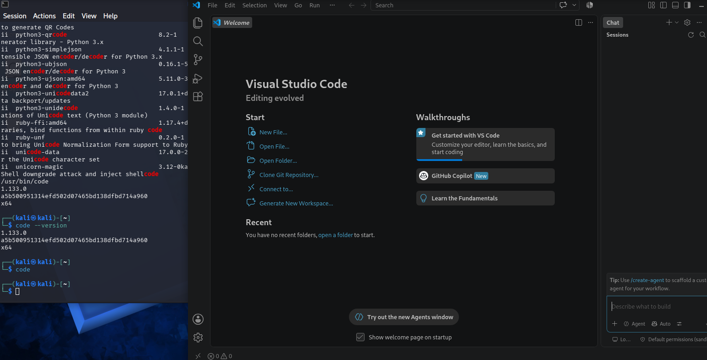


<div style="page-break-after: always;"></div>

<!-- ============================================================ -->
<!-- PASO 4 -->
<!-- ============================================================ -->

## Paso 4 – Instalación de Docker

**Docker** es una herramienta que permite ejecutar aplicaciones dentro de "contenedores": entornos aislados y livianos que incluyen todo lo necesario para que un programa funcione (código, librerías, configuración), sin necesidad de instalar cada componente por separado en el sistema operativo. Esto simplifica enormemente el despliegue de aplicaciones de práctica como las que se usan en este trabajo.

### 4.1. Instalación

Se instaló Docker utilizando el paquete disponible en los repositorios oficiales de Kali:

```bash
sudo apt update
sudo apt install -y docker.io
```

### 4.2. Verificación de la instalación

Se verificó que el servicio esté activo:
```bash
dpkg -l | grep docker
```
>**Info:** Al igual que sucedió con la instalación de Burp, este comando devuelve las instalaciones en el sistema referidas a Docker.


```bash
docker --version
```

>**Info:** Devuelve la versión del paquete instalado. En caso de no devolver nada, significa que no está correctamente instalado.

```bash
sudo systemctl status docker
```
>**Info:** Es la verdadera verificación sobre si Docker está corriendo correctamente.
> (Debe indicar `active (running)`)

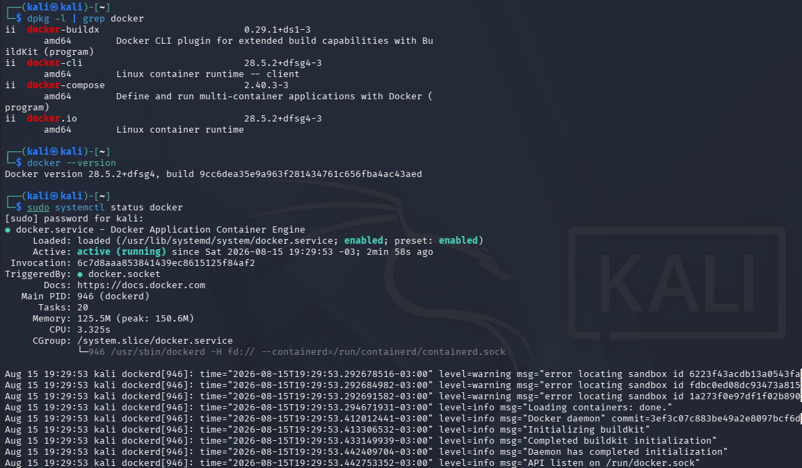

### 4.3. Prueba de funcionamiento

Se corroboró que Docker funciona correctamente ejecutando el contenedor de prueba `hello-world`:

```bash
sudo docker run hello-world
```

Si el comando descarga la imagen y muestra un mensaje de bienvenida, Docker quedó operativo.

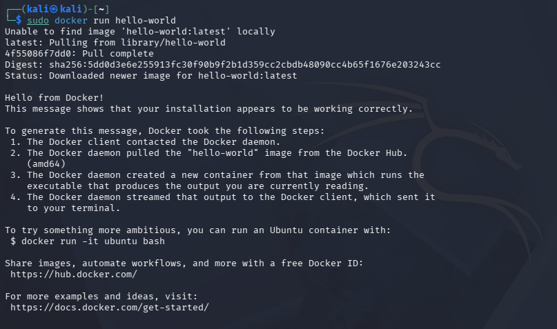

>**Info:** El contenedor `hello-world` es una herramienta oficial de diagnóstico diseñada para comprobar que Docker está instalado de forma correcta. Es simplemente un pequeño ejecutable que muestra un mensaje de confirmación y se cierra.

<div style="page-break-after: always;"></div>

<!-- ============================================================ -->
<!-- PASO 5 -->
<!-- ============================================================ -->

## Paso 5 – Ejecución de OWASP Juice Shop en un ambiente Dockerizado

**OWASP Juice Shop** es una aplicación web de comercio electrónico creada intencionalmente con vulnerabilidades de seguridad, utilizada como laboratorio de práctica para pentesting web.

### 5.1. Descarga y ejecución del contenedor

Se descargó y ejecutó la imagen oficial de Juice Shop en segundo plano con el siguiente comando:

```bash
sudo docker run --detach -p 3000:3000 bkimminich/juice-shop
```

**Explicación de cada parámetro:**

| Parámetro | Función |
|---|---|
| `--detach` (o `-d`) | Ejecuta el contenedor en segundo plano, liberando la terminal |
| `-p 3000:3000` | Conecta el puerto 3000 del contenedor con el puerto 3000 de la máquina virtual, permitiendo el acceso desde el navegador |
| `bkimminich/juice-shop` | Nombre de la imagen oficial en Docker Hub; se descarga automáticamente si no está presente en el sistema |

### 5.2. Verificación

```bash
sudo docker ps
```

Debe aparecer una línea con el contenedor de Juice Shop en estado `Up`, con el puerto `3000->3000` mapeado.

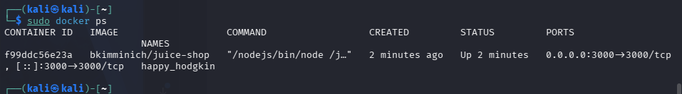


### 5.3. Acceso a la aplicación

Con el contenedor corriendo, se accedió a la aplicación desde el navegador en:

```
http://localhost:3000
```

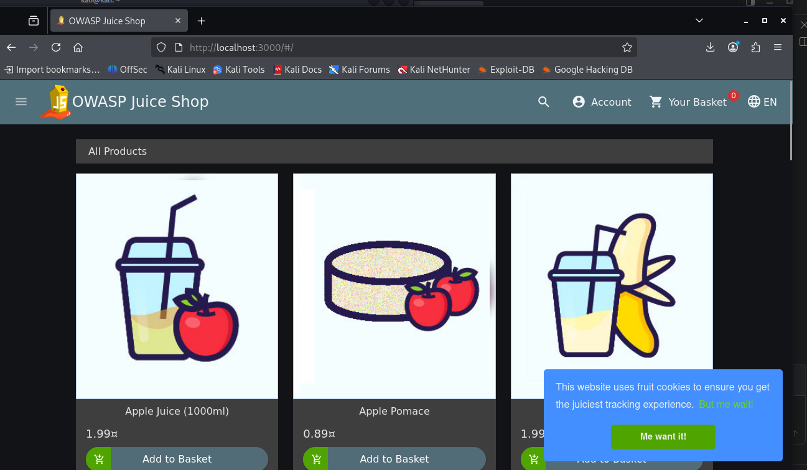


<div style="page-break-after: always;"></div>

<!-- ============================================================ -->
<!-- PASO 6 -->
<!-- ============================================================ -->

## Paso 6 – Ejecución de OWASP crAPI en un ambiente Dockerizado

**OWASP crAPI** ("completely ridiculous API") es una aplicación de práctica enfocada específicamente en vulnerabilidades de APIs, simulando un sistema de concesionaria de autos con múltiples servicios (identidad, comunidad, mensajería, bases de datos, etc.). Más información en https://owasp.org/www-project-crapi/.

A diferencia de Juice Shop, crAPI no es un único contenedor sino un conjunto de varios servicios que trabajan en conjunto, orquestados mediante **Docker Compose** (una herramienta que permite definir y levantar múltiples contenedores relacionados con un solo comando).

### 6.1. Descarga del proyecto

```bash
curl -L -o /tmp/crapi.zip https://github.com/OWASP/crAPI/archive/refs/heads/main.zip
unzip /tmp/crapi.zip -d ~/
cd ~/crAPI-main/deploy/docker
```

> **Importante:** todos los comandos siguientes deben ejecutarse siempre parado en esta carpeta (`~/crAPI-main/deploy/docker`), ya que ahí se encuentra el archivo `docker-compose.yml` que define los servicios.

### 6.2. Instalación de Docker Compose

Se verificó la disponibilidad de Docker Compose y, al no estar presente, se instaló con:

```bash
sudo apt install docker-compose -y
```

Verificación de la versión instalada:

```bash
docker-compose --version
```

### 6.3. Descarga de las imágenes

```bash
sudo docker-compose pull
```

> **Nota sobre permisos:** si este comando devuelve un error de tipo `permission denied` al intentar conectarse al socket de Docker, se debe a que el usuario no pertenece al grupo `docker`. La solución más rápida es anteponer `sudo` a los comandos, como se muestra arriba.

### 6.4. Levantamiento del stack completo

```bash
sudo docker-compose -f docker-compose.yml --compatibility up -d
```


### 6.5. Verificación de que todos los contenedores están activos

```bash
sudo docker-compose ps
```

Deben figurar todos los servicios (identity, community, chatbot, gateway, web, postgres, mongo, mailhog, etc.) en estado `Up`/`running`.

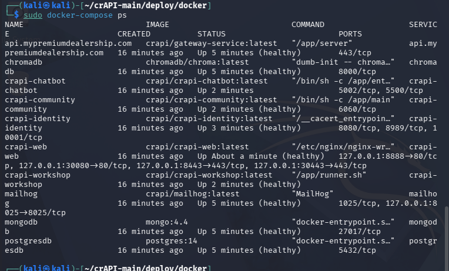

### 6.6. Reinicio de los contenedores tras apagar la máquina virtual

Los contenedores de Docker no arrancan automáticamente al reiniciar la máquina virtual. Para volver a activarlos sin necesidad de recrearlos ni descargar las imágenes nuevamente, se utiliza:

```bash
sudo docker-compose start
```
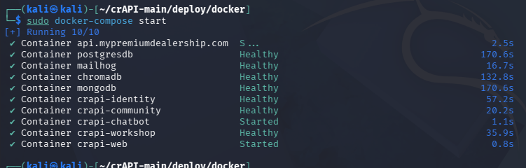

### 6.7. Acceso a la aplicación

```
http://localhost:8888
```
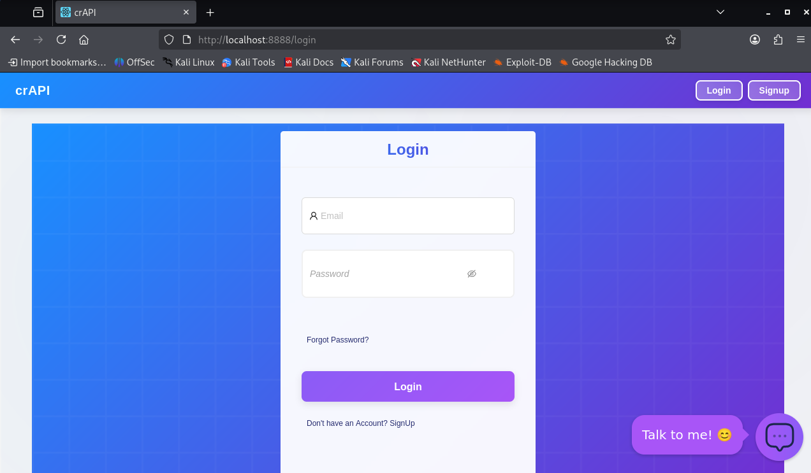

<div style="page-break-after: always;"></div>

<!-- ============================================================ -->
<!-- PASO 7 -->
<!-- ============================================================ -->

## Paso 7 – Prueba de visualización del tráfico en el proxy de interceptación

Con las aplicaciones de práctica ya corriendo, el último paso consiste en verificar que Burp Suite efectivamente logra interceptar el tráfico web generado al navegar dichas aplicaciones. Esta comprobación confirma que el ambiente de trabajo quedó correctamente configurado de punta a punta.

> **Prerrequisito:** los contenedores de Juice Shop y/o crAPI deben estar corriendo (ver Pasos 5 y 6).

### 7.1. Apertura de Burp Suite

Se inició Burp Suite desde la terminal:

```bash
burpsuite
```

Al abrir el proyecto, se seleccionó **"Temporary project"** → **"Use Burp defaults"**, para trabajar rápidamente con la configuración por defecto de la herramienta.

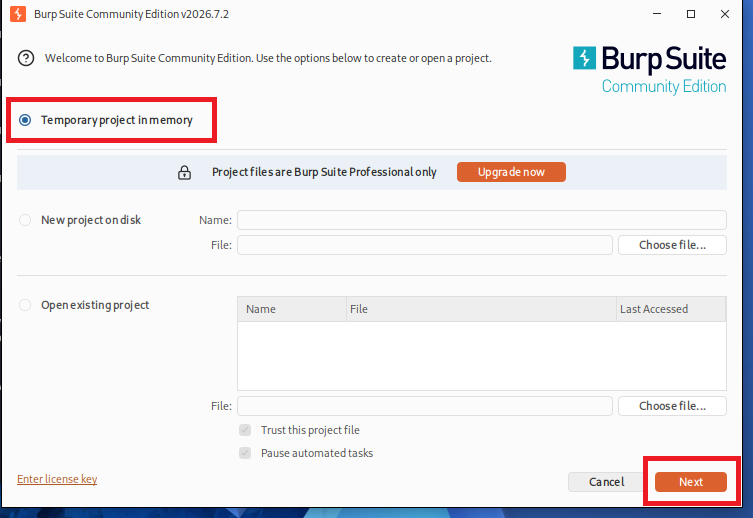
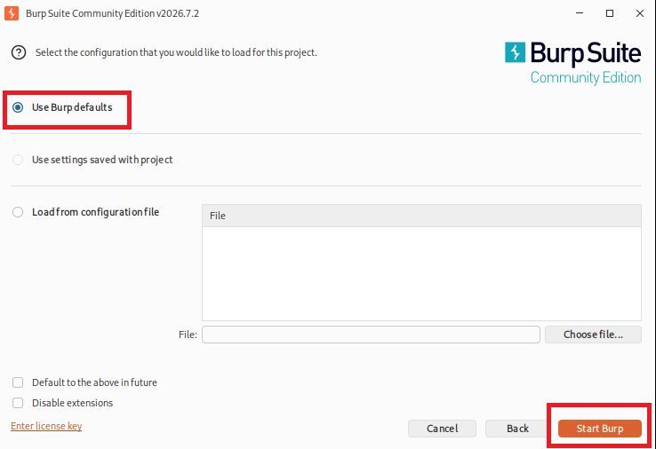

### 7.2. Verificación del listener del proxy

En la pestaña **Proxy → Proxy settings**, se confirmó la existencia de un listener activo (columna "Running" tildada) en:

```
127.0.0.1:8080
```

Este es el "punto de entrada" al cual el navegador debe enviar todo su tráfico para que Burp pueda interceptarlo.

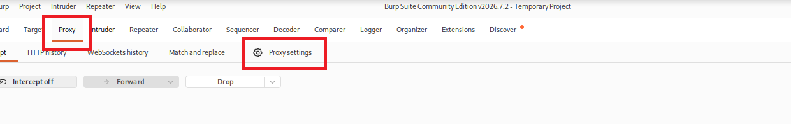
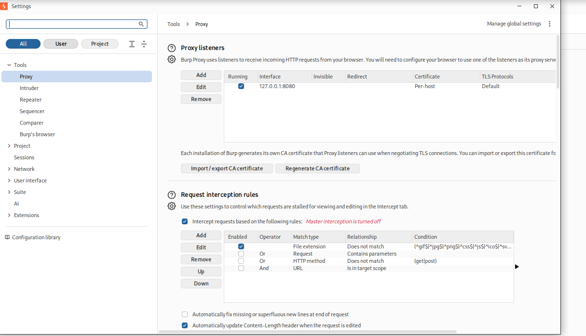


### 7.3. Configuración del navegador para usar el proxy

En Firefox: **Menú (☰) → Configuración → Red → Configuración de red → Configurar**.

- Se seleccionó **"Configuración manual del proxy"**.
- **HTTP Proxy:** `127.0.0.1` — **Puerto:** `8080`.
- Se marcó la opción **"Usar este proxy también para HTTPS"**.
- Se dejó vacío el campo **"Sin proxy para"**, para no excluir ningún destino.

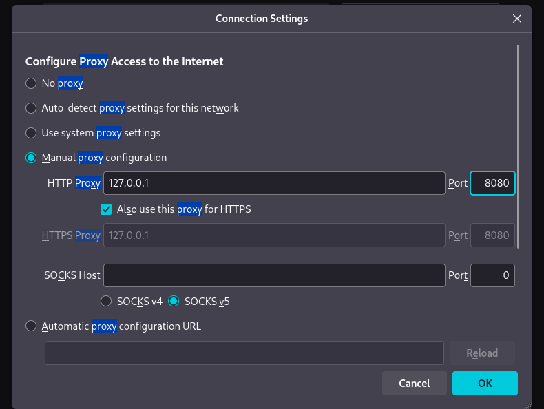
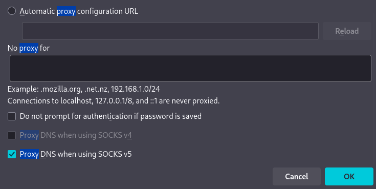


### 7.4. Instalación del certificado CA de Burp

Para poder interceptar tráfico cifrado (HTTPS) sin que el navegador muestre errores de certificado, es necesario instalar el certificado propio de Burp como una autoridad de confianza:

1. Con el proxy ya configurado, se accedió a `http://burpsuite` desde Firefox (una dirección especial que Burp reconoce y responde con su certificado).
2. Se descargó el certificado haciendo clic en **"CA Certificate"** (queda guardado como `cacert.der`).
3. En Firefox: **Configuración → Certificados → Ver certificados → pestaña Autoridades → Importar**.
4. Se seleccionó el archivo descargado y se marcó la opción **"Confiar en esta CA para identificar sitios web"**.

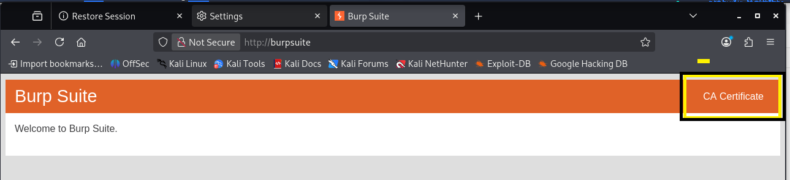
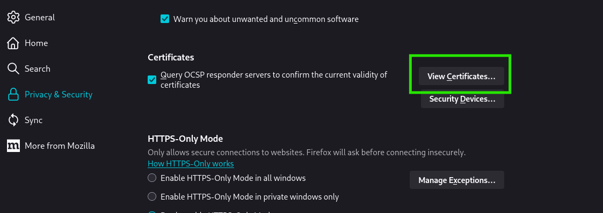
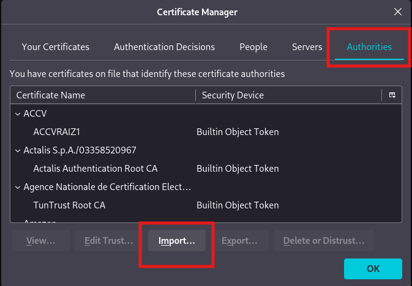
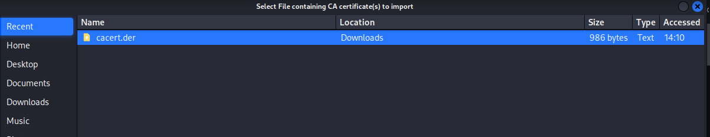
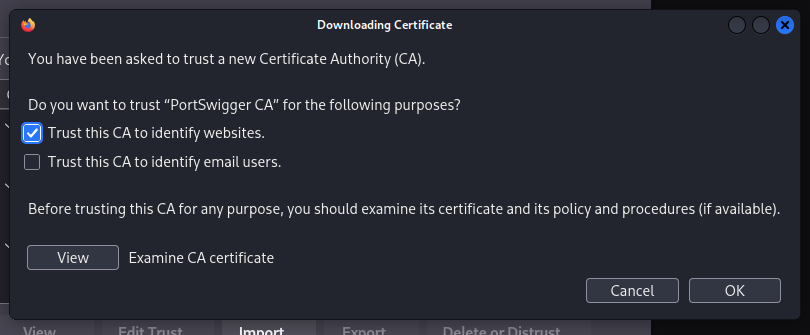

### 7.5. Activación de la intercepción

En la pestaña **Proxy → Intercept** de Burp, se confirmó que el botón indicara **"Intercept is on"**.

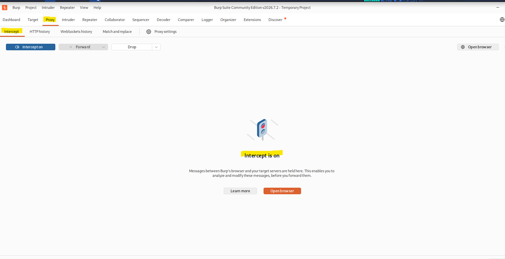


### 7.6. Generación de tráfico de prueba

Se navegó desde Firefox hacia una de las aplicaciones de práctica levantadas anteriormente, por ejemplo:

```
http://localhost:8888
```

> **Incidente registrado:** al navegar hacia `localhost:8888`, el tráfico no aparecía en Burp, mientras que el tráfico hacia otros sitios web sí lo hacía. Esto se debió a una restricción de seguridad incorporada en versiones modernas de Firefox, que **nunca** enruta a través de un proxy las conexiones dirigidas a `localhost`, `127.0.0.1` o `::1`, sin importar la configuración manual realizada. La solución consistió en habilitar la preferencia oculta `network.proxy.allow_hijacking_localhost` desde `about:config`, lo que permite que ese tráfico también sea proxeado y, por lo tanto, visible en Burp.

### 7.7. Verificación del tráfico interceptado

Con Intercept activo, cada solicitud HTTP quedó retenida en la pestaña **Proxy → Intercept**, mostrando el botón **"Forward"** (para dejarla continuar) o **"Drop"** (para descartarla).

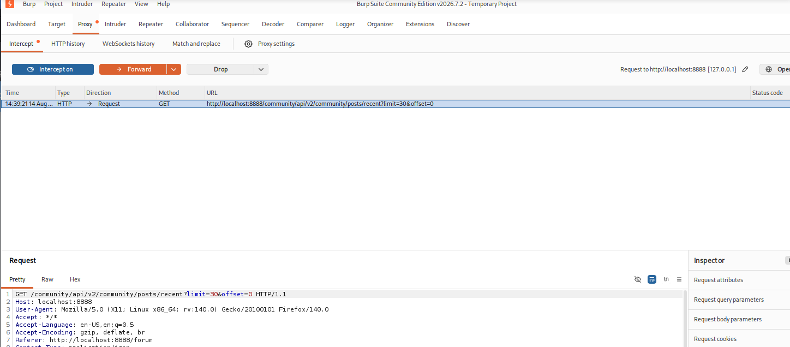

Para navegar de forma más fluida sin tener que confirmar cada solicitud manualmente, se desactivó Intercept (pasando a "off"). De esta forma, todo el tráfico generado queda registrado automáticamente en:

**Proxy → HTTP history**

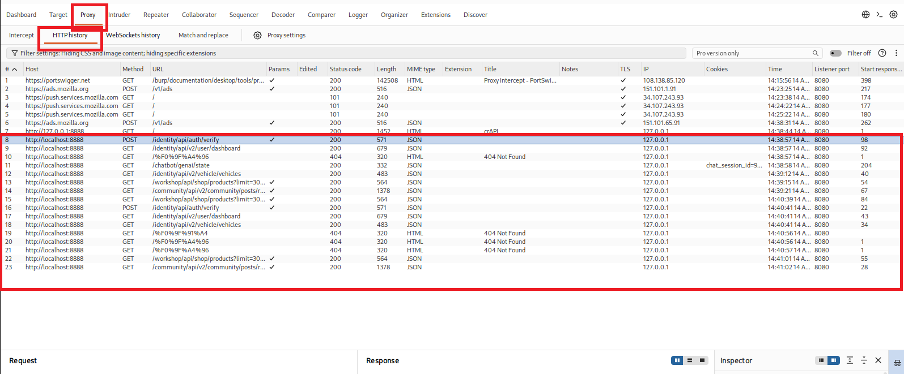


### 7.8. Confirmación de éxito

La aparición de entradas correspondientes a `localhost:8888` (o al dominio interno de la aplicación) en el HTTP history —incluyendo llamadas de login, registro y consultas a la API— confirmó que la interceptación de tráfico quedó funcionando correctamente, cerrando así la validación de todo el ambiente de trabajo.

<div style="page-break-after: always;"></div>

<!-- ============================================================ -->
<!-- CONCLUSIÓN -->
<!-- ============================================================ -->

## Conclusión

A lo largo de este práctico se logró armar, desde cero, un ambiente de trabajo completo para el análisis de seguridad de aplicaciones web: una máquina virtual aislada con Kali Linux, un editor de código, un proxy de interceptación (Burp Suite) y dos aplicaciones vulnerables de práctica (OWASP Juice Shop y OWASP crAPI) ejecutándose en contenedores Docker.

El proceso, de todas formas, estuvo afectado por un par de obstáculos (instaladores que no respondían, errores de permisos con Docker, conflictos de autenticación entre contenedores y restricciones de seguridad del navegador que impedían ver cierto tráfico) pero cada uno de esos inconvenientes permitió profundizar la comprensión del funcionamiento interno de las herramientas utilizadas, más allá de simplemente seguir instrucciones. La verificación final, viendo aparecer las solicitudes de crAPI en el historial de Burp, confirmó que todas las piezas del ambiente quedaron correctamente integradas entre sí.

Este ambiente configurado queda ahora disponible como base para las siguientes actividades prácticas de la materia, donde se utilizará para identificar y analizar vulnerabilidades concretas en las aplicaciones instaladas.

> Belén Kanas | Creación de Ambiente de Trabajo | Desarrollo de Software Seguro 2026
